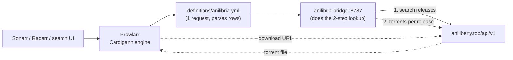

# AniLibria indexer for Prowlarr

A custom [Cardigann](https://wiki.servarr.com/prowlarr/cardigann-yml-definition)
definition for **AniLibria / AniLiberty**, plus a throwaway Prowlarr instance in
Docker so the definition can be tested against the live API.

## Why this is more than a `.yml` file

Two things about AniLibria shape the design:

**1. The site moved.** `anilibria.tv` is now an archive site unrelated to the
project, and the old API it used answers `HTTP 410 Gone`:

```
$ curl -s -o /dev/null -w '%{http_code}\n' 'https://api.anilibria.tv/v3/title/search?search=naruto'
410
```

The live API is `https://aniliberty.top/api/v1`
([docs](https://aniliberty.top/api/docs/v1)). There is no AniLibria definition in
[Prowlarr/Indexers](https://github.com/Prowlarr/Indexers) today.

**2. Search needs two requests.** A keyword search returns releases *without*
their torrents, so the torrents have to be fetched per release:

```
GET /app/search/releases?query=naruto   ->  releases (no torrents)
GET /anime/torrents/release/{id}        ->  the torrents of one release
```

Prowlarr's Cardigann engine cannot express that. A definition gets
[one request per search](https://github.com/Prowlarr/Indexers/blob/master/definitions/v11/schema.json)
(`SearchPathBlock` is `path`, `method`, `response`, `inputs`, `categories` —
there is no way to chain a second request off the first), and `/anime/torrents`
silently ignores every search-style parameter:

```
$ for p in f[search] search query q name keywords find filter title; do
    curl -s "https://aniliberty.top/api/v1/anime/torrents?limit=50&$p=naruto" | wc -c
  done | sort -u
325640        # every variant returns byte-identical output
```

So the two-step lookup is done by a small local service, and the definition
parses its single flattened response. Categories, titles, dates, poster URLs and
download links all stay in the YAML.



## Layout

```
docker-compose.yml            Prowlarr + the bridge
definitions/anilibria.yml     the custom indexer definition (mounted into Definitions/Custom)
bridge/app.py                 two-step -> single-response adapter (stdlib only)
scripts/validate_definition.py  checks the YAML against the Cardigann v11 schema
scripts/test_bridge.py          exercises the bridge directly
scripts/test_indexer.py         end-to-end test through Prowlarr
scripts/set_logging.py          toggles Prowlarr's indexer-response logging
```

## Quick start

```bash
docker compose up -d --build
```

Prowlarr is on <http://localhost:9696>. Then add the indexer:

1. **Indexers → Add Indexer → search for `AniLibria`** (it comes from the mounted
   `definitions/` folder, not from Prowlarr's downloaded bundle).
2. Save. Prowlarr validates it by running a keyword-less search.

Or do it from the API:

```bash
export KEY=$(python3 -c "import xml.etree.ElementTree as e;print(e.parse('config/config.xml').getroot().find('ApiKey').text)")
curl -s "http://localhost:9696/api/v1/indexer/schema" -H "X-Api-Key: $KEY" \
  | python3 -c "import json,sys;[print(s['name']) for s in json.load(sys.stdin) if s.get('definitionName')=='anilibria']"
```

## Injecting the definition into a Prowlarr container

Prowlarr reads custom definitions at runtime from the `Custom` folder inside its
app-data folder, which in Docker is `/config/Definitions/Custom`. Two things to
know first:

- **The `Custom` folder does not exist yet** in a stock container — only
  `/config/Definitions/` with the ~600 built-in definitions. You have to create
  it.
- **Do not put the file in `/config/Definitions/` directly.** Prowlarr refreshes
  that folder from `indexers.prowlarr.com` and overwrites it; `Custom/` is the
  one folder the updater leaves alone.

### With this repo

Nothing to do — `docker-compose.yml` already bind-mounts it:

```yaml
volumes:
  - ./config:/config
  - ./definitions:/config/Definitions/Custom
```

Because it is a bind mount, edits to `definitions/anilibria.yml` on the host show
up in the container immediately. You still have to reload Prowlarr afterwards
(see below).

### With your own Prowlarr container

Add the same mount to your compose file, so the definition stays on the host
where it is easy to edit and version:

```yaml
services:
  prowlarr:
    image: lscr.io/linuxserver/prowlarr:latest
    volumes:
      - /path/to/prowlarr/config:/config
      # add this: host folder -> Prowlarr's custom definitions folder
      - /path/to/this/repo/definitions:/config/Definitions/Custom
```

Then recreate the container so the mount takes effect:

```bash
docker compose up -d prowlarr
```

### Copying the file in instead

If you cannot change the container's volumes, copy the definition straight in.
Create the folder first, or `docker cp` will fail:

```bash
docker exec prowlarr mkdir -p /config/Definitions/Custom
docker cp definitions/anilibria.yml prowlarr:/config/Definitions/Custom/anilibria.yml
```

Verified on a container with no mount at all: 627 definitions loaded before, 628
after, with `anilibria` among them. Where the file ends up depends on how
`/config` is mounted:

| `/config` is a… | What `docker cp` gives you |
| --- | --- |
| bind mount (`- ./config:/config`) | writes through to the host folder, so it survives container recreation |
| named volume (`-v prowlarr_config:/config`) | stored in the volume; survives restarts, but is lost if the container is removed |
| nothing (container filesystem) | lost as soon as the container is recreated |

### Reloading after a change

Definitions and their request generators are cached, so an edit does not always
take effect straight away:

```bash
# usually enough
curl -s -X POST http://localhost:9696/api/v1/command \
  -H "X-Api-Key: $KEY" -H "Content-Type: application/json" \
  -d '{"name":"IndexerDefinitionUpdate"}'

# if the change still does not show up, restart
docker restart prowlarr
```

### Confirming it loaded

Open **Indexers → Add Indexer** and search for *AniLibria*, or use the schema
check shown under [Quick start](#quick-start). If it does not appear:

```bash
# is the file actually visible inside the container?
docker exec prowlarr head -3 /config/Definitions/Custom/anilibria.yml
```

Remember that definitions are only read from the top level of `Custom/` — a
subfolder there will be ignored — and that the `id` and `name` must not collide
with a definition that is already loaded.

## Tests

```bash
python3 scripts/validate_definition.py   # schema conformance, no containers needed
python3 scripts/test_bridge.py           # the bridge alone, from the host
python3 scripts/test_indexer.py          # full path: Prowlarr -> bridge -> AniLibria
```

`test_indexer.py` deletes and re-adds the indexer, runs keyword searches,
checks every result has a unique GUID and an infohash, downloads a result and
verifies it is a real bencoded torrent, and checks the keyword-less path that
RSS sync uses. It takes its queries from `argv`, so
`python3 scripts/test_indexer.py "one piece" bleach` works too.

Last run against the live API:

```
2. register the indexer
  [PASS] indexer added and validated by Prowlarr (id=3)
3. search through Prowlarr
  [PASS] search 'naruto' returned results - 9 releases
  [PASS] every result has a unique guid - 9/9
  [PASS] search 'kizumonogatari' returned results - 6 releases
4. torrent download
  [PASS] downloaded file is a bencoded torrent - 261627 bytes
5. keyword-less search (RSS sync)
  [PASS] keyword-less search returned results - 50 releases
RESULT: all checks passed
```

## What a result looks like

```
Naruto- Shippuuden - AniLiberty.TOP [HDTVRip 720p][AVC][370-500]
  size=52787876553  seeders=17  categories=[TV/Anime]

Kizumonogatari I- Tekketsu-hen - AniLiberty.TOP [BDRip 1080p][AVC][Фильм]
  size=4356198082   seeders=24  categories=[Movies/Other]
```

`category` is the API's own `release.type`, so the mapping needs no template:
`TV`, `WEB`, `OVA`, `ONA`, `OAD`, `SPECIAL` → `TV/Anime`; `MOVIE` →
`Movies/Other`; `DORAMA` → `TV`.

## Bridge settings

Set in `docker-compose.yml`:

| Variable | Default | Purpose |
| --- | --- | --- |
| `ANILIBRIA_API_BASE` | `https://aniliberty.top/api/v1` | Upstream API |
| `BRIDGE_MAX_RELEASES` | `10` | How many matched releases to expand into torrents per search |
| `BRIDGE_REQUEST_DELAY` | `0.2` | Delay between those per-release requests, seconds |
| `BRIDGE_CACHE_TTL` | `300` | Seconds a search result is reused |
| `BRIDGE_API_MAX_LIMIT` | `50` | The API rejects `limit > 50` with HTTP 422 |

To run the bridge outside this compose stack, change the `search.paths[0].path`
in `definitions/anilibria.yml` to e.g. `http://host.docker.internal:8787/search`
and forward port 8787. The host cannot be templated: Prowlarr decides whether a
path is absolute by parsing the raw string, *before* substituting templates, so a
templated host gets treated as a relative path and prefixed with the site link.

## Limitations

- **Keyword search only.** `modes: search: [q]`. Season/episode and movie search
  are not advertised, and the API has no season, episode, IMDB or TMDB filters to
  build them from. Add `tv-search: [q, season, ep]` to `caps.modes` if you want
  Sonarr to be able to use the indexer.
- **Titles are the upstream torrent names** (e.g. `... - AniLibria.TOP [WEBRip
  1080p][HEVC][1-11]`), not cleaned up for Sonarr.
- **A search resolves at most `BRIDGE_MAX_RELEASES` releases**, so a very broad
  term can return fewer torrents than expected. Raise it at the cost of latency:
  the per-release requests are sequential and rate-limited on purpose.
- **GUIDs are the download URLs.** Prowlarr prefers `download` over `details` as
  the GUID source; both contain the infohash, so they are stable and unique.
- AniLibria is freeleech, so `downloadvolumefactor` is 0.

## Debugging a definition

Prowlarr does not complain when a selector matches nothing or a category id
cannot be resolved — the data is just silently missing. Turn on response logging
and it prints what it parsed:

```bash
python3 scripts/set_logging.py on
# run a search, then:
docker exec prowlarr tail -60 /config/logs/prowlarr.debug.txt
python3 scripts/set_logging.py off
```

This is what caught the one real gotcha here: **Prowlarr's template engine has no
`else if`.** A category template like

```yaml
text: "{{ if eq .Result._type \"MOVIE\" }}movie{{ else if eq .Result._type \"DORAMA\" }}dorama{{ else }}anime{{ end }}"
```

produced a literal `movie{{ else if .False }}dorama` and the log said so:

```
Warn|Cardigann|[anilibria] Invalid category for value: 'movie{{ else if .False }}dorama'
```

Other notes for anyone editing the definition:

- Prowlarr caches definitions and request generators; after editing the YAML,
  trigger `IndexerDefinitionUpdate` or restart the container. Editing a setting
  reloads, but the cached request generator does not always keep up.
- Field values land in `{{ .Result.<name> }}` and are evaluated in declaration
  order, so `_`-prefixed working values must come before the fields that use them.
- The API caps `/anime/torrents` at `limit=50` (`limit=51` returns HTTP 422).

## Credits

The category mapping and general shape follow Jackett's
[`Anilibria.cs`](https://github.com/Jackett/Jackett/blob/master/src/Jackett.Common/Indexers/Definitions/Anilibria.cs),
which moved to `aniliberty.top` on 2025-06-28.
