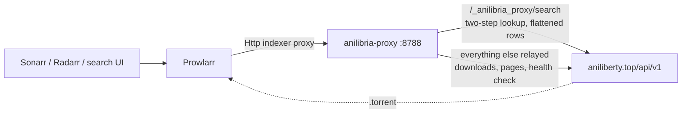

# AniLibria indexer for Prowlarr

A custom [Cardigann](https://wiki.servarr.com/prowlarr/cardigann-yml-definition)
definition for **AniLibria / AniLiberty**, a small HTTP proxy that makes keyword
search possible, and a throwaway Prowlarr instance in Docker to test it against
the live API.

## Why a proxy is needed

**1. The site moved.** `anilibria.tv` is now an archive site unrelated to the
project, and the old API under it answers `HTTP 410 Gone`:

```
$ curl -s -o /dev/null -w '%{http_code}\n' 'https://api.anilibria.tv/v3/title/search?search=naruto'
410
```

The live API is `https://aniliberty.top/api/v1`
([docs](https://aniliberty.top/api/docs/v1)). There is no AniLibria definition in
[Prowlarr/Indexers](https://github.com/Prowlarr/Indexers) today.

**2. Search needs two requests.** A keyword search returns releases *without*
their torrents, so the torrents have to be fetched per release:

```
GET /app/search/releases?query=naruto   ->  releases (no torrents)
GET /anime/torrents/release/{id}        ->  the torrents of one release
```

Prowlarr's Cardigann engine cannot express that. A definition gets
[one request per search](https://github.com/Prowlarr/Indexers/blob/master/definitions/v11/schema.json)
(`SearchPathBlock` is `path`, `method`, `response`, `inputs`, `categories` —
there is no way to chain a second request off the first), and `/anime/torrents`
silently ignores every search-style parameter:

```
$ for p in f[search] search query q name keywords find filter title; do
    curl -s "https://aniliberty.top/api/v1/anime/torrents?limit=50&$p=naruto" | wc -c
  done | sort -u
325640        # every variant returns byte-identical output
```

So the two-step lookup happens in `proxy/`, which Prowlarr reaches through its
built-in **"Http" indexer proxy** support.

## How it works



The proxy answers exactly one path — `/_anilibria_proxy/search` — with the
flattened rows the definition parses, and **relays every other request to the
real destination**. Release pages, `.torrent` downloads and Prowlarr's own proxy
health check all pass straight through, so the site keeps working normally and
only the search hop changes.

That split is what makes the proxy's location configurable from Prowlarr itself:
the definition's search path never changes, and where the proxy runs is just the
indexer proxy's host and port.

## Layout

```
docker-compose.yml            Prowlarr + the proxy
Dockerfile                    the proxy image (context is the repo root)
.dockerignore                 keeps config/ and the rest out of the build context
definitions/anilibria.yml     the custom indexer definition (mounted into Definitions/Custom)
proxy/app.py                  forward proxy: diverts one route, relays the rest
.env.example                  port and tuning for the proxy
scripts/validate_definition.py  checks the YAML against the Cardigann v11 schema
scripts/configure_proxy.py      registers the proxy with Prowlarr, adds the indexer
scripts/test_proxy.py           the proxy alone: divert route, relaying, downloads
scripts/test_indexer.py         end-to-end through Prowlarr
scripts/check_empty_baseurl.py  indexer works with an empty Base Url
scripts/set_logging.py          toggles Prowlarr's indexer-response logging
```

## Quick start

```bash
docker compose up -d --build
python3 scripts/configure_proxy.py
```

The second command creates the tag, the `Http` indexer proxy and the AniLibria
indexer, and binds them together. Prowlarr is on <http://localhost:9696>.

Equivalent by hand: **Settings → Indexer Proxies → Add** an *Http* proxy at
`anilibria-proxy:8788`, tag it, then add the indexer with that tag selected.
The tag has to be set when the indexer is *added*: saving runs a test search, and
that search only succeeds once the proxy is in play.

Where the proxy runs is that proxy's host and port, editable any time in the UI.
Prowlarr validates the address when it saves, rejecting an unreachable one with
a clear `Connection refused (host:port)`, so it cannot be silently wrong.

## Tests

```bash
python3 scripts/validate_definition.py   # schema conformance, no containers needed
python3 scripts/test_proxy.py            # divert route, relaying, CONNECT, downloads
python3 scripts/check_empty_baseurl.py   # indexer works with an empty Base Url
python3 scripts/test_indexer.py          # full path: Prowlarr -> proxy -> AniLibria
```

`test_indexer.py` deletes and re-adds the indexer (keeping its tags, so the proxy
stays bound), runs keyword searches, checks every result has a unique GUID and an
infohash, downloads a result and verifies it is a real bencoded torrent, and
checks the keyword-less path that RSS sync uses. It takes queries from `argv`:

```bash
python3 scripts/test_indexer.py "one piece" bleach
```

To confirm traffic is really being split, watch the proxy log while searching:

```bash
docker compose logs --tail=30 anilibria-proxy
#   DIVERT GET aniliberty.top/_anilibria_proxy/search q='naruto' limit=50
#   tunnel aniliberty.top:443          <- the .torrent download
#   tunnel prowlarr.servarr.com:443    <- Prowlarr's proxy health check
```

Note the site sits behind Cloudflare, which answers the default Python
`User-Agent` with `403 error code: 1010`. Real clients (and Prowlarr) send their
own, so this only bites when hand-testing with `urllib`.

## What a result looks like

```
Naruto- Shippuuden - AniLiberty.TOP [HDTVRip 720p][AVC][370-500]
  size=52787876553  seeders=17  categories=[TV/Anime]

Kizumonogatari I- Tekketsu-hen - AniLiberty.TOP [BDRip 1080p][AVC][Фильм]
  size=4356198082   seeders=24  categories=[Movies/Other]
```

`category` is the API's own `release.type`, so the mapping needs no template:
`TV`, `WEB`, `OVA`, `ONA`, `OAD`, `SPECIAL` → `TV/Anime`; `MOVIE` →
`Movies/Other`; `DORAMA` → `TV`.

## Proxy settings

Set in `docker-compose.yml`, or override in `.env`:

| Variable | Default | Purpose |
| --- | --- | --- |
| `ANILIBRIA_API_BASE` | `https://aniliberty.top/api/v1` | Upstream API |
| `PROXY_PORT` | `8788` | Listener port |
| `PROXY_DIVERT_PREFIX` | `/_anilibria_proxy` | Path answered locally; everything else is relayed |
| `PROXY_MAX_RELEASES` | `10` | How many matched releases to expand into torrents per search |
| `PROXY_REQUEST_DELAY` | `0.2` | Delay between those per-release requests, seconds |
| `PROXY_CACHE_TTL` | `300` | Seconds a search result is reused |
| `PROXY_API_MAX_LIMIT` | `50` | The API rejects `limit > 50` with HTTP 422 |

`PROXY_DIVERT_PREFIX` and the search path in `definitions/anilibria.yml` must
agree. Changing the prefix is the one case where the definition needs editing.

## Limitations

- **Keyword search only.** `modes: search: [q]`. Season/episode and movie search
  are not advertised, and the API has no season, episode, IMDB or TMDB filters to
  build them from. Add `tv-search: [q, season, ep]` to `caps.modes` if you want
  Sonarr to be able to use the indexer.
- **Titles are the upstream torrent names** (e.g. `... - AniLibria.TOP [WEBRip
  1080p][HEVC][1-11]`), not cleaned up for Sonarr.
- **A search resolves at most `PROXY_MAX_RELEASES` releases**, so a very broad
  term can return fewer torrents than expected. Raise it at the cost of latency:
  the per-release requests are sequential and rate-limited on purpose.
- **GUIDs are the download URLs.** Prowlarr prefers `download` over `details` as
  the GUID source; both contain the infohash, so they are stable and unique.
- AniLibria is freeleech, so `downloadvolumefactor` is 0.

## Injecting the definition into a container

Prowlarr reads custom definitions from the `Custom` folder inside its app-data
folder — `/config/Definitions/Custom` in Docker. Two things to know first:

- **The `Custom` folder does not exist yet** in a stock container; only
  `/config/Definitions/` with the ~600 built-ins. Create it.
- **Do not put the file in `/config/Definitions/` directly.** Prowlarr refreshes
  that folder from `indexers.prowlarr.com` and overwrites it — and until it does,
  a file there *shadows* the custom one. See
  [Searches go to the old anilibria.tv API](#searches-go-to-the-old-anilibriatv-api-410-gone).
  `Custom/` is the one folder the updater leaves alone.

With this repo, `docker-compose.yml` already bind-mounts it:

```yaml
volumes:
  - ./config:/config
  - ./definitions:/config/Definitions/Custom
```

For your own Prowlarr, add the same mount and recreate the container:

```yaml
services:
  prowlarr:
    image: lscr.io/linuxserver/prowlarr:latest
    volumes:
      - /path/to/prowlarr/config:/config
      - /path/to/this/repo/definitions:/config/Definitions/Custom
```

If you cannot change volumes, copy it in — creating the folder first, or the
`docker cp` fails:

```bash
docker exec prowlarr mkdir -p /config/Definitions/Custom
docker cp definitions/anilibria.yml prowlarr:/config/Definitions/Custom/anilibria.yml
```

Verified on a container with no mount at all: 627 definitions loaded before, 628
after, with `anilibria` among them. Where the file lands depends on how `/config`
is mounted: a bind mount writes through to the host folder and survives container
recreation; a named volume survives restarts but is lost if the container is
removed.

Definitions are cached, so after replacing the file reload before expecting a
change:

```bash
docker restart prowlarr
# or: curl -s -X POST http://localhost:9696/api/v1/command \
#       -H "X-Api-Key: $KEY" -H "Content-Type: application/json" \
#       -d '{"name":"IndexerDefinitionUpdate"}'
```

Definitions are only read from the top level of `Custom/` — a subfolder there is
ignored — and `id` and `name` must not collide with a definition already loaded.

## Troubleshooting

### "Unknown Cardigann setting" when saving the indexer

```
System.ArgumentOutOfRangeException: Unknown Cardigann setting. (Parameter 'info_bridge')
   at Prowlarr.Api.V1.Indexers.IndexerResourceMapper.ToModel(...)
```

This happens when the definition declares a custom `settings` entry. On save,
Prowlarr resolves **every** non-standard field the form submitted against the
definition the *server* has loaded:

```cs
var cardigannSetting = cardigannDefinition.Settings.FirstOrDefault(x => x.Name == field.Name);
if (cardigannSetting == null)
{
    throw new ArgumentOutOfRangeException(field.Name, "Unknown Cardigann setting.");
}
```

So if the server's (possibly cached) copy does not contain that setting — a stale
cache, or a build that does not read `settings` from `Definitions/Custom` — the
indexer cannot be saved at all. That is why this definition ships
`settings: []` and hardcodes its URLs. You can reproduce the check with any
unknown field name:

```bash
curl -s -X POST http://localhost:9696/api/v1/indexer -H "X-Api-Key: $KEY" \
  -H "Content-Type: application/json" \
  -d '{"name":"probe","implementation":"Cardigann","configContract":"CardigannSettings",
       "definitionName":"anilibria","enable":true,"protocol":"torrent","appProfileId":1,
       "fields":[{"name":"definitionFile","value":"anilibria"},{"name":"nope","value":"x"}]}'
```

### The "Base Url" dropdown is empty when adding the indexer

Prowlarr fills that dropdown from the definition's `links` — `IndexerFactory`
does `definition.IndexerUrls = defFile.Links.ToArray()` — and for custom
definitions it can come back blank. It does not affect this indexer: the search
request is an **absolute** URL, and release pages, downloads and posters hardcode
`https://aniliberty.top/` rather than relying on `.Config.sitelink`.

**Leave it empty and carry on.** If you do set it, pick a value from the list
instead of clearing it to an empty string: Prowlarr answers an empty string with
*"Invalid URI: The URI is empty."* and refuses to save, while an untouched empty
dropdown stores `null` and is accepted.

### Searches go to the old anilibria.tv API (410 Gone)

```
Unable to connect to indexer. Unexpected response status Gone code from indexer request
```

A leftover `anilibria.yml` in `/config/Definitions/` — the built-in bundle folder
— **shadows** the custom definition. Definitions are resolved by file name, and
that folder is searched alongside `Custom/`, so the stray file wins.

Verified by planting a legacy probe there. Prowlarr requested:

```
Adding request for AniLibria: https://api.anilibria.tv/v3/title/updates?filter=...&limit=100
```

instead of the definition's own search route, and every save or search failed
with `410 Gone`. Note the API's schema list can still show the *custom* entry
while requests use the stray file, so this is easy to misread. Remove it:

```bash
docker exec prowlarr rm -f /config/Definitions/anilibria.yml
docker restart prowlarr
```

The definition updater would overwrite that file eventually, but until then it
shadows — so only ever put custom definitions in `Custom/`.

### The indexer fails with "Unable to connect to indexer"

That is the proxy being unreachable, not AniLibria, or no proxy assigned at all:

```bash
python3 scripts/configure_proxy.py --remove && python3 scripts/configure_proxy.py
docker compose logs --tail=30 anilibria-proxy
python3 scripts/set_logging.py on   # then look for "Adding request for AniLibria"
```

A `404` from the real site means the proxy is *not* in play — the definition's
search route hit the site directly. A DNS or connection error names the host
Prowlarr could not reach.

## Debugging a definition

Prowlarr does not complain when a selector matches nothing or a category id
cannot be resolved — the data is just silently missing. Turn on response logging
and it prints what it parsed:

```bash
python3 scripts/set_logging.py on
# run a search, then:
docker exec prowlarr tail -60 /config/logs/prowlarr.debug.txt
python3 scripts/set_logging.py off
```

This is what caught the one real gotcha here: **Prowlarr's template engine has no
`else if`.** A category template like

```yaml
text: "{{ if eq .Result._type \"MOVIE\" }}movie{{ else if eq .Result._type \"DORAMA\" }}dorama{{ else }}anime{{ end }}"
```

produced a literal `movie{{ else if .False }}dorama` and the log said so:

```
Warn|Cardigann|[anilibria] Invalid category for value: 'movie{{ else if .False }}dorama'
```

Other notes for anyone editing the definition:

- **Do not add custom `settings`.** A field the server cannot resolve makes the
  indexer impossible to save; see
  [Unknown Cardigann setting](#unknown-cardigann-setting-when-saving-the-indexer).
- **The search path host cannot be templated.** Prowlarr decides whether a path
  is absolute by parsing the raw string *before* substituting templates, so
  `{{ .Config.x }}/search` collapses into
  `https://www.aniliberty.top/http%3A%2F%2F...`. `baseUrl` is a dropdown over the
  site's own URLs, not a text box, so it cannot carry one either.
- Prowlarr caches definitions and request generators; after editing the YAML,
  trigger `IndexerDefinitionUpdate` or restart the container. Editing a setting
  reloads, but the cached request generator does not always keep up.
- Field values land in `{{ .Result.<name> }}` and are evaluated in declaration
  order, so `_`-prefixed working values must come before the fields that use them.
- The API caps `/anime/torrents` at `limit=50` (`limit=51` returns HTTP 422).

## Credits

The category mapping and general shape follow Jackett's
[`Anilibria.cs`](https://github.com/Jackett/Jackett/blob/master/src/Jackett.Common/Indexers/Definitions/Anilibria.cs),
which moved to `aniliberty.top` on 2025-06-28.
